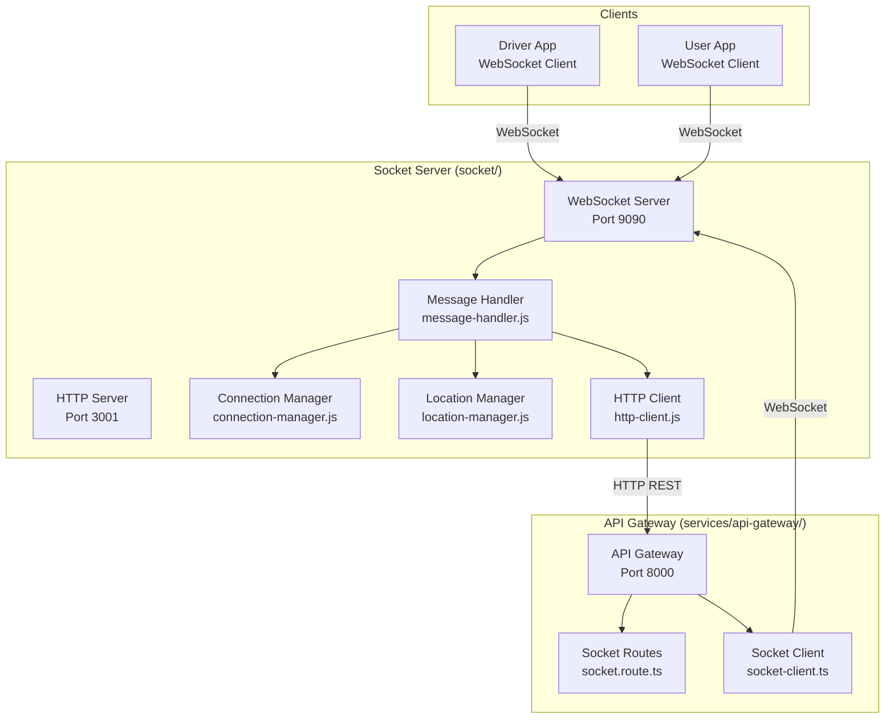

# Socket Server & API Gateway Communication Architecture

## Overview

This document analyzes the communication patterns between the **Socket Server** (`socket/`) and the **API Gateway/Server** (`server/` and `services/api-gateway/`).

## Architecture Diagram



## Communication Patterns

### 1. Socket Server → API Gateway (HTTP REST)

**Direction:** Socket Server calls API Gateway  
**Protocol:** HTTP REST  
**Client:** `socket/http-client.js` (ServerHttpClient class)  
**Base URL:** `http://127.0.0.1:8000` (from `SERVER_URL` env var)

#### Endpoints Called:

| Endpoint | Method | Purpose | Called From |
|----------|--------|---------|-------------|
| `/test` | GET | Health check / connection test | `testConnection()` |
| `/health` | GET | Periodic health check | `healthCheck()` |
| `/api/v1/socket/driver/:id/validate` | GET | Validate driver credentials & subscription | `validateDriver()` |
| `/api/v1/socket/ride/:id` | GET | Get ride details | `getRideDetails()` |
| `/api/v1/socket/ride-event` | POST | Notify ride events (accepted/started/completed/cancelled) | `notifyRideEvent()` |
| `/api/v1/socket/driver-status` | POST | Update driver online/offline status | `updateDriverStatus()` |
| `/api/v1/socket/driver-location` | POST | Sync driver location to Firestore | `syncDriverLocation()` |
| `/api/v1/socket/active-drivers` | GET | Get active drivers with locations | `getActiveDriversWithLocations()` |

#### Features:
- **Circuit Breaker Pattern**: Prevents cascading failures
- **Exponential Backoff**: Retry logic with increasing delays
- **Connection Pooling**: HTTP keep-alive for performance
- **Request/Response Interceptors**: Logging and error handling
- **Timeout**: 15 seconds per request

### 2. API Gateway → Socket Server (WebSocket)

**Direction:** API Gateway connects to Socket Server  
**Protocol:** WebSocket (ws://)  
**Client:** `services/api-gateway/src/utils/socket-client.ts` (SocketClient class)  
**URL:** `ws://localhost:9090` (from `SOCKET_WS_URL` env var)

#### Messages Sent:

| Message Type | Method | Purpose |
|--------------|--------|---------|
| `requestNearbyDrivers` | `requestNearbyDrivers()` | Request nearby drivers for a location |
| `notifyDriverOfRide` | `notifyDriverOfRide()` | Notify driver of new ride request |
| `broadcastRideUpdate` | `broadcastRideUpdate()` | Broadcast ride status updates |
| `notifyUserOfDriverStatus` | `notifyUserOfDriverStatus()` | Notify user about driver status changes |
| `notifyRideCancellation` | `notifyRideCancellation()` | Send ride cancellation notification |
| `notifyPaymentConfirmation` | `notifyPaymentConfirmation()` | Send payment confirmation |
| `sendDriverLocationUpdate` | `sendDriverLocationUpdate()` | Send driver location to user |
| `broadcastSystemMessage` | `broadcastSystemMessage()` | Broadcast system-wide messages |
| `sendEmergencyAlert` | `sendEmergencyAlert()` | Send emergency alerts |
| `heartbeat` | `sendHeartbeat()` | Keep connection alive (every 60s) |

#### Features:
- **Auto-reconnect**: Exponential backoff on connection loss
- **Heartbeat**: 60-second intervals to keep connection alive
- **Event Emitter**: Emits events for connection status, messages, errors
- **Singleton Pattern**: Single instance shared across the application

### 3. Clients → Socket Server (WebSocket)

**Direction:** Mobile/Web clients connect to Socket Server  
**Protocol:** WebSocket (ws://)  
**Server:** `socket/server.js` (WebSocketServer on port 9090)

#### Message Types Handled:

**Driver Messages:**
- `driverOnline` - Driver comes online with location
- `driverOffline` - Driver goes offline
- `locationUpdate` - Driver location update
- `acceptRide` - Driver accepts a ride
- `startRide` - Driver starts a ride
- `completeRide` - Driver completes a ride
- `cancelRide` - Driver cancels a ride

**User Messages:**
- `requestRide` - User requests a ride
- `nearbyDrivers` - Query nearby drivers
- `driverLocation` - Get specific driver location

**System Messages:**
- `heartbeat` - Keep-alive ping
- `connectionStatus` - Connection state updates

## File Structure Analysis

### Socket Server (`socket/`)

#### Core Files:

1. **`server.js`** (775 lines)
   - Main entry point
   - Creates WebSocket server (port 9090) and HTTP server (port 3001)
   - Handles WebSocket connections and message routing
   - Manages in-memory driver locations
   - Calls `http-client.js` to communicate with API Gateway

2. **`http-client.js`** (439 lines)
   - HTTP client for calling API Gateway
   - Implements circuit breaker pattern
   - Exponential backoff retry logic
   - Connection pooling with keep-alive
   - Methods: `testConnection()`, `validateDriver()`, `getRideDetails()`, `notifyRideEvent()`, etc.

3. **`message-handler.js`** (456 lines)
   - Handles all WebSocket message types
   - Routes messages to appropriate handlers
   - Validates message schemas
   - Integrates with connection and location managers

4. **`connection-manager.js`** (270 lines)
   - Manages WebSocket connections
   - Tracks driver and user connections separately
   - Connection limits and statistics
   - Activity tracking and cleanup

5. **`location-manager.js`** (226 lines)
   - Manages driver locations in memory
   - Finds nearby drivers using geolib
   - Location validation and cleanup
   - Radius-based search

6. **`types.js`** (161 lines)
   - Defines all message types and schemas
   - Message validation helpers
   - Standard message format

7. **`config.js`** (43 lines)
   - Centralized configuration
   - Port settings (HTTP: 3001, WS: 9090)
   - Connection limits
   - CORS origins

8. **`server-clean.js`** (459 lines)
   - Alternative implementation with cleaner architecture
   - Uses class-based structure
   - Better separation of concerns

### API Gateway (`services/api-gateway/`)

#### Core Files:

1. **`src/utils/socket-client.ts`** (377 lines)
   - WebSocket client connecting to Socket Server
   - Sends real-time notifications
   - Auto-reconnect with exponential backoff
   - Heartbeat mechanism

2. **`src/routes/socket.route.ts`** (395 lines)
   - HTTP endpoints for Socket Server to call
   - Authentication via `X-Socket-Secret` header
   - Handles: ride events, driver status, location sync, validation

3. **`src/app.ts`** (150 lines)
   - Express app setup
   - Middleware configuration
   - Route registration
   - Includes `/test` endpoint for health checks

4. **`src/server.ts`** (47 lines)
   - HTTP server creation
   - Listens on port 8000
   - Binds to `0.0.0.0` for IPv4/IPv6 compatibility

### Legacy Server (`server/`)

#### Core Files:

1. **`utils/socket-client.ts`** (377 lines)
   - **NOTE:** This is a legacy file, now updated to use port 9090
   - Similar to API Gateway's socket-client but older version
   - Used by legacy server implementation
   - Now uses centralized `SocketConfig` class for port configuration

2. **`app.ts`** (150 lines)
   - Legacy Express app
   - Similar structure to API Gateway

3. **`server.ts`** (10 lines)
   - Simple HTTP server setup
   - Port 8000

## Communication Flow Examples

### Example 1: Driver Goes Online

```
1. Driver App → Socket Server (WebSocket)
   Message: { type: 'driverOnline', role: 'driver', driverId: '123', data: { latitude: -22.5, longitude: 17.0 } }

2. Socket Server → API Gateway (HTTP POST)
   POST /api/v1/socket/driver-status
   Body: { driverId: '123', status: 'online', location: { latitude: -22.5, longitude: 17.0 } }

3. API Gateway → Firestore
   Updates driver status and location in database

4. Socket Server → Driver App (WebSocket)
   Response: { type: 'driverOnline', success: true, message: 'Driver is now online' }
```

### Example 2: User Requests Ride

```
1. User App → Socket Server (WebSocket)
   Message: { type: 'requestRide', role: 'user', userId: '456', latitude: -22.5, longitude: 17.0, ... }

2. Socket Server (Internal)
   - Finds nearby drivers using LocationManager
   - Returns list to user

3. Socket Server → Nearby Drivers (WebSocket)
   Broadcast: { type: 'rideRequested', rideRequest: {...} }

4. Driver Accepts → Socket Server (WebSocket)
   Message: { type: 'acceptRide', role: 'driver', rideId: '789', driverId: '123' }

5. Socket Server → API Gateway (HTTP POST)
   POST /api/v1/socket/ride-event
   Body: { rideId: '789', event: 'accepted', data: { driverId: '123', eta: 5 } }

6. API Gateway → Firestore
   Updates ride status to 'accepted'

7. API Gateway → Socket Server (WebSocket via socket-client)
   Message: { type: 'notifyUserOfDriverStatus', userId: '456', driverId: '123', status: 'accepted' }

8. Socket Server → User App (WebSocket)
   Notification: { type: 'rideAccepted', rideId: '789', driverId: '123', ... }
```

### Example 3: Driver Location Update

```
1. Driver App → Socket Server (WebSocket)
   Message: { type: 'locationUpdate', role: 'driver', driverId: '123', data: { latitude: -22.51, longitude: 17.01 } }

2. Socket Server (Internal)
   - Updates in-memory location (LocationManager)
   - Periodically syncs to Firestore (every 30s)

3. Socket Server → API Gateway (HTTP POST)
   POST /api/v1/socket/driver-location
   Body: { driverId: '123', latitude: -22.51, longitude: 17.01, status: 'online' }

4. API Gateway → Firestore
   Updates driver location in database

5. If user is tracking driver:
   API Gateway → Socket Server (WebSocket)
   Message: { type: 'sendDriverLocationUpdate', userId: '456', driverId: '123', location: {...} }

6. Socket Server → User App (WebSocket)
   Update: { type: 'driverLocation', driverId: '123', location: {...} }
```

## Key Configuration

### Environment Variables

**Socket Server:**
- `WEBSOCKET_PORT` - WebSocket port (default: 9090, auto-corrects 8080)
- `HTTP_PORT` - HTTP API port (default: 3001)
- `SERVER_URL` - API Gateway URL (default: http://localhost:8000)
- `API_SECRET` - Secret for authenticating with API Gateway (default: londa-socket-secret-2024)

**API Gateway:**
- `SOCKET_WS_URL` - Socket Server WebSocket URL (default: ws://localhost:9090)
- `SOCKET_SERVER_URL` - Socket Server HTTP URL (default: http://localhost:3001)
- `SOCKET_API_SECRET` - Secret for authenticating socket requests (default: londa-socket-secret-2024)
- `PORT` - API Gateway port (must be 8000)

## Authentication

### Socket Server → API Gateway
- Uses `X-Socket-Secret` header
- Value: `API_SECRET` env var (default: 'londa-socket-secret-2024')
- Validated in `socket.route.ts` middleware

### API Gateway → Socket Server
- No authentication required (WebSocket connection)
- Connection is established on startup
- Heartbeat keeps connection alive

## Error Handling

### Socket Server HTTP Client
- **Circuit Breaker**: Opens after 5 consecutive failures
- **Retry Logic**: Exponential backoff (1s, 2s, 4s, 8s, 16s)
- **Timeout**: 15 seconds per request
- **Graceful Degradation**: Continues operating even if API Gateway is unavailable

### API Gateway Socket Client
- **Auto-reconnect**: Up to 5 attempts with exponential backoff
- **Heartbeat**: 60-second intervals
- **Non-blocking**: API Gateway continues if socket server unavailable
- **Warning Logs**: Errors logged as warnings, not fatal

## Current Issues & Solutions

### Issue 1: Port Mismatch ✅ RESOLVED
**Problem:** Socket server default was 8080, API Gateway expects 9090  
**Solution:** 
- Auto-correction in `socket/server.js` (lines 17-25)
- Centralized configuration classes created (`SocketConfig` in both `server/config/` and `services/api-gateway/src/config/`)
- All hardcoded 8080 references updated to 9090
- Environment variable defaults updated to 9090

### Issue 2: Startup Timing
**Problem:** Socket server tries to connect before API Gateway is ready  
**Solution:** Increased delays (10 seconds for both services)

### Issue 3: IPv6/IPv4 Binding
**Problem:** API Gateway was binding to IPv6 only  
**Solution:** Explicitly bind to `0.0.0.0` for dual-stack support

### Issue 4: Connection Timeouts
**Problem:** HTTP requests timing out (15s)  
**Status:** Under investigation - requests reach server but not Express handlers

## Data Flow Summary

1. **Real-time Communication**: Clients ↔ Socket Server (WebSocket)
2. **Data Persistence**: Socket Server → API Gateway (HTTP REST) → Firestore
3. **Notifications**: API Gateway → Socket Server (WebSocket) → Clients
4. **Location Tracking**: Driver → Socket Server (in-memory) → API Gateway (periodic sync to Firestore)
5. **Ride Management**: User/Driver → Socket Server → API Gateway → Firestore → Notifications back to clients

## Dependencies

**Socket Server:**
- `express` - HTTP server
- `ws` - WebSocket server
- `axios` - HTTP client for API Gateway
- `geolib` - Location calculations
- `cors` - CORS middleware

**API Gateway:**
- `express` - HTTP server
- `ws` - WebSocket client
- Various middleware for security, logging, etc.

## Performance Considerations

- **Connection Pooling**: HTTP client uses keep-alive connections
- **In-Memory Storage**: Driver locations cached in Socket Server
- **Periodic Sync**: Location sync to Firestore every 30 seconds (configurable)
- **Connection Limits**: Max 1000 total, 500 drivers, 500 users
- **Heartbeat**: 60-second intervals to detect dead connections

